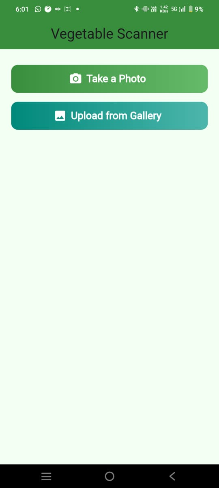
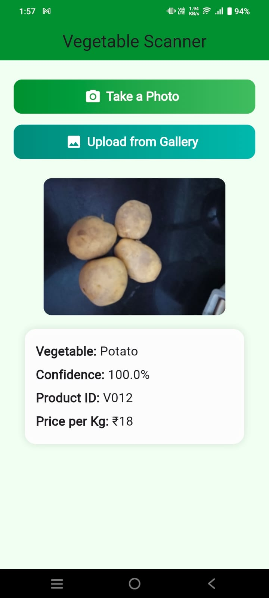

# 🥕 Vegetable Scanner App

A cross-platform Flutter app that identifies vegetables from an image using a FastAPI backend powered by a trained ML model.

## 📱 Features

- 📸 **Camera Integration**: Take photos or upload from gallery
- 🤖 **AI-Powered Recognition**: Uses FastAPI backend with trained ML model
- 📊 **Detailed Results**: Shows vegetable name, confidence score, product ID, and price per kg
- 📝 **Weight Input**: Manual weight entry for price calculation
- 📋 **Scan History**: Track all scanned items with timestamps
- 📈 **Report Generation**: View comprehensive scanning reports
- 🎨 **Modern UI**: Polished interface with gradient buttons and cards
- 📱 **Cross-Platform**: Works on Android and iOS

---

## 🚀 Getting Started

### 📦 Prerequisites

- **Flutter SDK**: 3.0 or higher
- **Dart SDK**: Latest stable version
- **IDE**: Android Studio, VS Code, or IntelliJ with Flutter/Dart plugins
- **Device**: Android emulator, iOS simulator, or physical device

### 🔧 Installation & Setup

1. **Clone the repository**
   ```bash
   git clone https://github.com/GudiseMeghana/vegetable-scanner-api.git
   cd vegetable-scanner-api/vegetable_scanner_app
   ```

2. **Install Flutter dependencies**
   ```bash
   flutter pub get
   ```

3. **Check Flutter setup**
   ```bash
   flutter doctor
   ```

4. **Run the application**
   ```bash
   # For development
   flutter run
   
   # For specific device
   flutter run -d <device_id>
   
   # For release build
   flutter run --release
   ```

### 📱 Building for Different Platforms

#### Android APK
```bash
# Debug APK
flutter build apk --debug

# Release APK
flutter build apk --release

# Split APK by ABI (smaller file sizes)
flutter build apk --split-per-abi
```

#### Android App Bundle (for Play Store)
```bash
flutter build appbundle --release
```

#### iOS (macOS only)
```bash
# Debug build
flutter build ios --debug

# Release build
flutter build ios --release
```

---

## 🔗 API Integration

The app connects to a FastAPI backend deployed at:
**[https://vegetable-scanner-api.onrender.com/predict/](https://vegetable-scanner-api.onrender.com/predict/)**

### API Details
- **Method**: POST
- **Content-Type**: `multipart/form-data`
- **Request**: Image file upload
- **Response**: JSON with structured data:
  ```json
  {
    "vegetable": "tomato",
    "confidence": "95.2",
    "product_id": "VEG_001",
    "price_per_kg": "₹40"
  }
  ```

---

## 📂 Project Structure

```
vegetable_scanner_app/
├── lib/
│   └── main.dart              # Main application logic and UI
├── assets/
│   └── icon.png              # App launcher icon
├── android/                  # Android-specific configuration
├── ios/                      # iOS-specific configuration
├── screenshots/              # App screenshots
│   ├── ui.png
│   └── result.png
└── pubspec.yaml             # Flutter dependencies
```

---

## 🛠️ Development Commands

### Useful Flutter Commands

```bash
# Check Flutter installation and setup
flutter doctor -v

# Clean build files
flutter clean

# Get dependencies
flutter pub get

# Update dependencies
flutter pub upgrade

# Run app in debug mode
flutter run --debug

# Run app in profile mode (performance testing)
flutter run --profile

# Run app in release mode
flutter run --release

# List connected devices
flutter devices

# Format code
flutter format .

# Analyze code for issues
flutter analyze

# Run tests
flutter test
```

### Device-Specific Commands

```bash
# Run on specific device
flutter run -d chrome          # Web browser
flutter run -d macos          # macOS desktop
flutter run -d windows        # Windows desktop
flutter run -d linux          # Linux desktop

# Install APK on connected Android device
flutter install

# Hot reload (during development)
# Press 'r' in terminal while app is running

# Hot restart (during development)
# Press 'R' in terminal while app is running
```

---

## 🧪 Testing & Deployment

### Testing Platforms
- **Android Emulator**: Built-in Android Studio emulator
- **Physical Android Device**: Enable USB debugging and connect via USB
- **iOS Simulator**: Xcode simulator (macOS only)
- **Physical iOS Device**: Requires Apple Developer account and Xcode

### Testing Commands
```bash
# Run unit tests
flutter test

# Run integration tests
flutter drive --target=test_driver/app.dart

# Generate test coverage
flutter test --coverage
```

### Deployment

#### Android Play Store
1. Create a signed APK or App Bundle:
   ```bash
   flutter build appbundle --release
   ```
2. Upload to Google Play Console

#### iOS App Store (macOS only)
1. Build for iOS:
   ```bash
   flutter build ios --release
   ```
2. Open `ios/Runner.xcworkspace` in Xcode
3. Archive and upload to App Store Connect

---

## 📸 Screenshots

<p align="center">
  
  
</p>

> **Note**: If screenshots don't display, ensure `ui.png` and `result.png` are present in the `screenshots/` folder.

---

## 🤝 Contributing

1. **Fork the repository**
2. **Create a feature branch**
   ```bash
   git checkout -b feature/new-feature
   ```
3. **Make your changes**
4. **Commit your changes**
   ```bash
   git commit -m "Add new feature"
   ```
5. **Push to the branch**
   ```bash
   git push origin feature/new-feature
   ```
6. **Create a Pull Request**

---

## 🐛 Troubleshooting

### Common Issues

**Build Issues:**
```bash
# Clean and rebuild
flutter clean
flutter pub get
flutter run
```

**Dependency Issues:**
```bash
# Reset dependencies
rm pubspec.lock
flutter pub get
```

**Android Issues:**
```bash
# Accept Android licenses
flutter doctor --android-licenses

# Gradle issues
cd android && ./gradlew clean && cd ..
```

**iOS Issues (macOS only):**
```bash
# Clean iOS build
rm -rf ios/Pods ios/Podfile.lock
cd ios && pod install && cd ..
```

---

## 👩‍💻 Development Team

- **Meghana Gudise**
- **Rithvika Punnam**
- **Vaagdevi Challa**
- **Sankrishna Kuchana**
- **Vishwajitha Byru**
- **Pruthan Jamalapuram**

---

## 📄 License

This project is licensed under the MIT License. See the [LICENSE](LICENSE) file for details.

---

## 🔗 Related Links

- [Flutter Documentation](https://docs.flutter.dev/)
- [Dart Documentation](https://dart.dev/guides)
- [FastAPI Backend Repository](https://github.com/GudiseMeghana/vegetable-scanner-api)
- [Live API Endpoint](https://vegetable-scanner-api.onrender.com/predict/)
